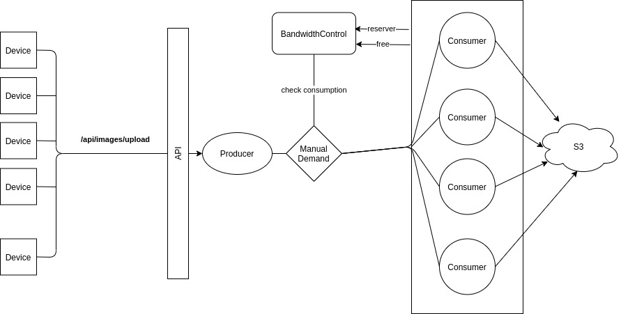

## The Problem

At a company there are several thousand devices, each taking photos every 30 seconds. Photos are used in computer vision processing and analysis by other people in the company. To avoid outgoing network saturation, devices upload to a local API server instead of all uploading to S3 at once. The local API server then further has the ability to queue files locally and upload to S3 at a controlled rate.Your taskUsing Elixir, build an API server that accepts image file uploads and throttles the image upload to S3 to achieve optimal performance. The API should have a single endpoint that receives a multipart request where the payload in the request consists of two parts: device_id and image. The image value should be the image binary.
While the device → API upload is the requirement for this exercise, we'd like you to focus on how you would approach uploading to S3 and the local queueing process to control the outgoing rate. We're also interested to see how you can leverage automated testing to increase reliability for this feature. Additionally, feel free to mock out the AWS APIs. It is not important that you have a working integration with any AWS services.Some assumptions you may make

Local network upload speed is 200mbps.
	Image file size is an average of 4mb.
	Allocate no more than 50% of bandwidth resources for file uploads at any time.
	Application will receive roughly 1,000 images per minute but can also receive bursts of many more that we'll need to handle.

## Flow Diagram



## Installation and Start

- Install dependencies with
```
mix deps.get
```
- Run local server (Development mode):
```
iex -S mix
```

## Test

- With this script you can simulate a light load: 1000 images and 10 devices 
```console
> ./test/light_load_test.sh
```

- With this script you can simulate a heavy load: 100000 images and 150 devices 
```console
> ./test/heavy_load_test.sh
```